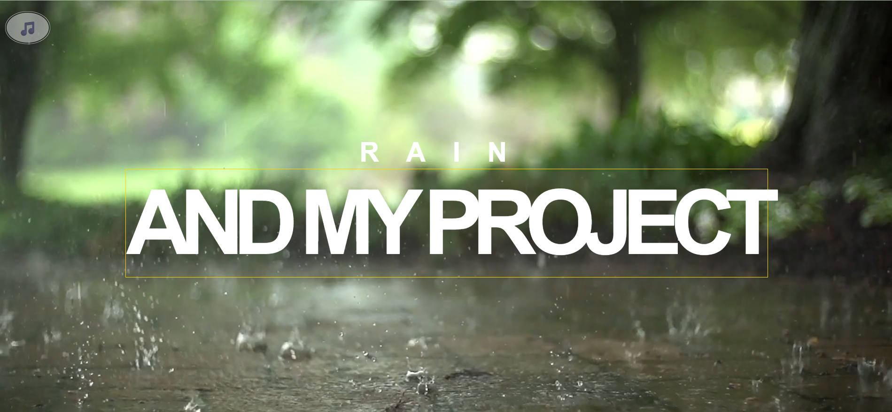

# 🌧️ About Rain

**About Rain** is a beautiful, minimalist web project that presents fascinating facts and science about rain. All information is curated from reliable sources like Wikipedia and is designed for easy reading and quick learning.

🌐 [Visit the site](https://about-rain.netlify.app)

---

## ✨ Features

- 🖋️ Well-written overview and facts about rain  
- 📚 Information sourced from Wikipedia  
- 🎨 Elegant, soothing web design  
- 🌌 Visually pleasing layout and typography  
- ⚡ Fast and secure with Netlify hosting  

---

## 🚀 Getting Started

No installation required — just visit the site and explore!

---

## 🛠️ Technologies Used

- **Frontend:** HTML5, CSS3  
- **Hosting:** Netlify  

---

## 📌 Roadmap & Future Ideas

- 📷 Add more pictures and diagrams  
- 🎞️ Embed educational videos about rain  
- 💬 Expand content with more science facts or trivia  

---

## 📜 License

This project is open source — feel free to fork, modify, and share.

---
